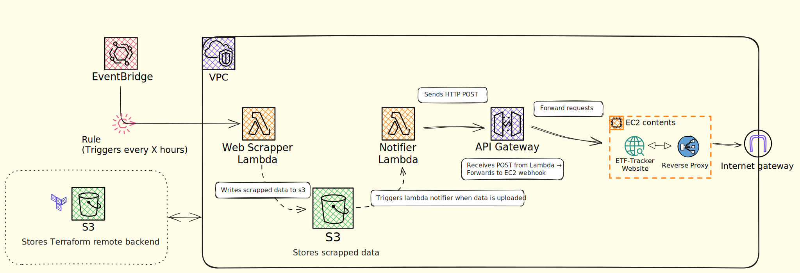

# ETF Dashboard 📈

A full-stack application for tracking and visualizing Exchange-Traded Fund (ETF) data in near real-time. Built to showcase web scraping, cloud infrastructure automation with Terraform, and frontend dashboard design.


## Features

- Real-time ETF price updates (every hour)
- Terraform-managed infrastructure
- Serverless architecture with AWS Lambda, S3.


## 🧠 Decision Log

Every major decision I made while building this project is documented in this [ETF Tracker Project Journal](https://lacy-helicopter-80d.notion.site/19b50889ae4f81fc805bc1fca13aa7df?v=19b50889ae4f8190ae1c000c9640b9ad).


## Project Overview

The ETF Dashboard scrapes ETF data from selected sources, stores the data in AWS S3, and displays it in a user-friendly frontend dashboard hosted on an EC2. The backend is fully serverless, leveraging AWS Lambda and S3.


## ⚙️ Tech Stack

### Backend      
- **AWS EventBridge** - Triggers scraping jobs on schedule
- **AWS Lambda** – Python-powered web scraper
- **AWS S3** – Storage for scraped data
- **Terraform** – Infrastructure as Code for deployment

### Frontend    
- **React** – Interactive dashboard UI
- **Hosted on EC2** – Simplified frontend hosting


## Architecture Diagram




## Data Flow

1. Lambda scrapes ETF data on a schedule or trigger.
2. Scraped data is saved to an S3 bucket.
4. Frontend dashboard fetches and displays the latest data on demand.


## Project Structure

```
etf-dashboard/
├── bootstrap/                 # For storing tf state and initiate backend S3 setup
│   └── main.tf
├── frontend/                  # React app
├── scraper/                   # Lambda functions
│   ├── scraper/               # Python scraper Lambda
├── terraform/
│   ├── modules/              # Reusable Terraform modules
│   │   ├── lambda/
│   │   ├── s3/
│   │   ├── eventbridge/
│   │   └── ec2/
│   ├── variables.tf          # Global variables
│   ├── backend.tf            # To store the remote state
│   ├── providers.tf          # Provider config (AWS, region, etc.)
│   └── main.tf               # Root module
├── tools/                    # Helpers scripts
├── .gitignore
└── README.md

```

## Getting Started

### Prerequisites
- Terraform installed
- AWS CLI configured
- Node.js & npm/yarn installed (for frontend)

### Setup
## 🛠️ One-time Setup (after clone)
run setup.sh (set your own tracked .githooks)
```bash
bash setup.sh
```
Then you need to zip the lambda script with its dependencies by running the package-lambda.sh inside /scraper
```bash
bash package-lambda.sh
```
Follow-up by running terraform commands inside the infrastructure folder /terraform
```bash
terraform init
terraform plan
terraform apply
```


## 🧪 To Do

- [ ]  Add Webhook-based refresh optional for live updates
- [ ]  Use CDN in front of S3 for caching OR in memory cache (Redis)
- [ ]  Add rate limits on S3 fetch or UI throttling

### Nice To have
- [ ]  Use Terraform output to write the EC2 IP to GitHub Secrets automatically (using tools like Terraform Cloud or GitHub’s OIDC auth)
- [ ]  Automate the update of security group policies for SSH with GitHub Actions IPs before every deploy (separate project) 

## 📄 License

[MIT License](LICENSE)
