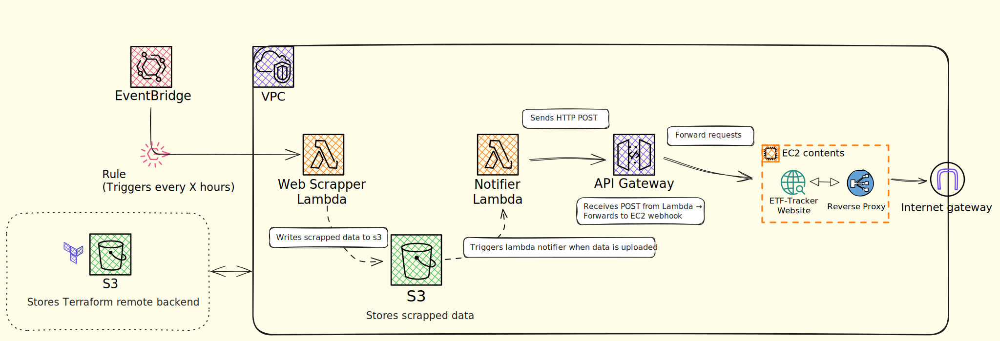

# ETF Dashboard 📈

A full-stack application for tracking and visualizing Exchange-Traded Fund (ETF) data in near real-time. Built to showcase web scraping, cloud infrastructure automation with Terraform, and frontend dashboard design.

## 🧠 Project Overview

The ETF Dashboard scrapes ETF data from selected sources, stores the data in AWS S3, and displays it in a user-friendly frontend dashboard. The backend is fully serverless, leveraging AWS Lambda, API Gateway, and S3.

## ⚙️ Tech Stack

### Backend        
- **AWS EventBridge** - Triggers scraping jobs on schedule
- **AWS Lambda** – Python-powered web scraper
- **AWS S3** – Storage for scraped data
- **AWS API Gateway** – Exposes webhooks or endpoints
- **Terraform** – Infrastructure as Code for deployment

### Frontend    
- **React** – Interactive dashboard UI
- **Hosted on EC2** – Simplified frontend hosting

## 🗺️ Architecture Diagram



## 🔁 Data Flow

1. Lambda scrapes ETF data on a schedule or trigger.
2. Scraped data is saved to an S3 bucket.
3. (Optional) S3 triggers a second Lambda to notify the frontend via webhook or update cache.
4. Frontend dashboard fetches and displays the latest data.

## 🚀 Getting Started

### Prerequisites
- Terraform installed
- AWS CLI configured
- Node.js & npm/yarn installed (for frontend)

### Setup

#### 1. Infrastructure
#
```bash
cd infrastructure
terraform init
terraform apply
```
## 🧪 To Do

- [ ]  Add pagination and filtering on frontend
- [ ]  Implement auto-refresh using webhooks or polling
- [ ]  Add authentication (JWT)
- [ ]  Deploy frontend with HTTPS & domain setup (e.g. Route 53 + Caddy/Nginx)

## 📄 License

[MIT License](LICENSE)
